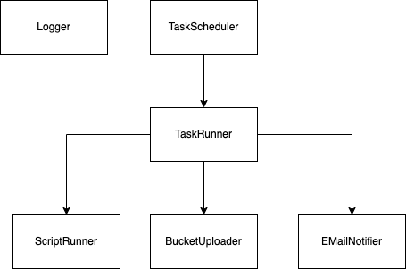

# ru(by)-back(up)-se(rvice)

---
**WORK IN PROGRESS**

This is a simple ruby service to schedule/manage automated backups. Backups can be scheduled or done manually. Notifications via an email service can be configured. The backup can be encrypted an uploaded to cloud storage.

---

## Features / Todo

| Fatures to implement  |
|---|
| ✅ Custom logger service  |
| ✅ Command runner service  |
| ⬜ File backup service  |
| ⬜ Notification service  |
| ⬜ Cloud upload service  |
| ⬜ Encryption service  |
| ⬜ Docker image |
| ⬜ Sinatra endpoints |

---

## Service Structure

---

## Docker

---

## Build with

---
